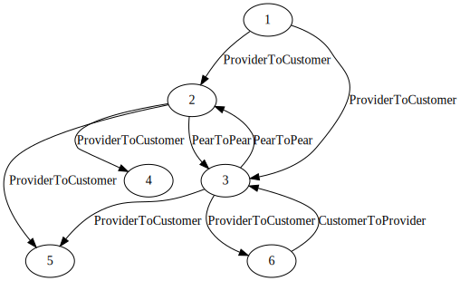
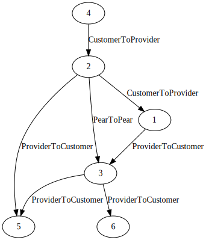

# Valley Free Explorer

[](https://github.com/bgpkit/valley-free/actions/workflows/build.yaml)
[](https://crates.io/crates/valley-free)
[](https://docs.rs/valley-free)
[](https://raw.githubusercontent.com/bgpkit/valley-free/main/LICENSE)

`valley-free` crate is a Rust package that reads CAIDA's [AS-relationship data][asrel]
and explores AS-level paths using `valley-free` model.

[asrel]: https://www.caida.org/data/as-relationships/

## Core Ideas

### Topology Building

The first step for doing `valley-free` paths simulation is to obtain AS-level
topology and inter-AS relationships. Here in this library, we utilize CAIDA's
[AS-relationship data][asrel] data to obtain both the AS relationships and the
topology.

The CAIDA's AS-relationship data is formatted as follows:
```
## A FEW LINES OF COMMENT
## A FEW LINES OF COMMENT
## A FEW LINES OF COMMENT
1|7470|0
1|9931|-1
1|11537|0
1|25418|0
2|35000|0
2|263686|0
...
```

The data format is:
```example
<provider-as>|<customer-as>|-1
<peer-as>|<peer-as>|0
```

A non-comment row in the dataset means:
- there is a AS-level link between the two ASes
- the relationships are either peer-to-peer (0) or provider-to-customer (-1)

### Path Propagation

It generate a graph simulating the AS paths propagation from the origin and 
creating a graph of all the possible paths in the way of the propagation.

For exemplo for the following topology:



It start from the AS4 and form a direct graph with all next hops that confom 
wih valley-free routing (i.e. the path with the next hop is stil valley-free),
and keeps propagate until generate a direct acyclic graph (DAG) with all with the 
"valley-free view" of the AS4 to the network.



And then you can use this DAG with all the classic graph methods to analyze it.
For example, you can find the [length of all shortest paths](https://docs.rs/petgraph/latest/petgraph/algo/k_shortest_path/fn.k_shortest_path.html),
or even [all the paths](https://docs.rs/petgraph/latest/petgraph/algo/simple_paths/fn.all_simple_paths.html).

## Usage

### Rust

#### Install
``` toml
[dependencies]
valley_free="0.3"
```

#### Examples
To use the examples expect the [CAIDA-as 2023-12-01 dataset](https://publicdata.caida.org/datasets/as-relationships/serial-1/20231201.as-rel.txt.bz2)
on the root directory.

The examples are available in the [`examples/`](examples/) direction.

You can run it with `cargo run --example=<filename without .rs>`.

### Python

The package is available on PyPi at https://pypi.org/project/valley-free/. 
For installation, `pip3 install valley-free` should do the trick.

``` python
#!/usr/bin/env python3

import valley_free

topo = valley_free.load_topology("20161101.as-rel.txt.bz2")
paths = valley_free.propagate_paths(topo, 15169)

print(len(paths))
# 117074
```

#### Manually build Python package 

Build for current Python environment:
`maturin build --release --features py`

Build using manylinux environment:
`docker run --rm -v $(pwd):/io konstin2/maturin build --release --features py`
